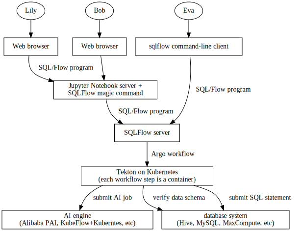
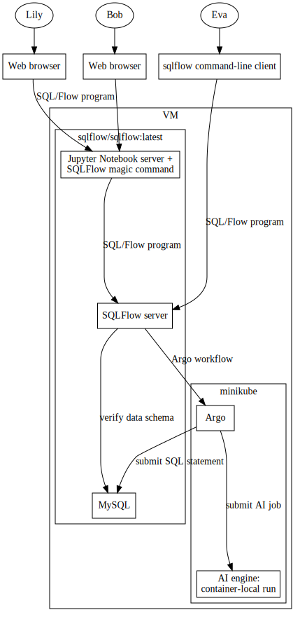

# Provision SQLFlow Desktop for Linux

This is an experimental work to check deploying the whole
[SQLFlow](https://sqlflow.org/sqlflow) service mesh on Windows, Linux,
or macOS desktop.

The general architecture of SQLFlow is as the following:



In this deployment, we have Jupyter Notebook server, SQLFlow server,
and MySQL running in a container executing the
`sqlflow/sqlflow:latest` image.  Argo runs on a minikube cluster
running on the VM.  The deployment is shown in the folllowing figure:



I chose this deployment plan for reasons:

1. We don't have a well-written local workflow engine, and at the
   right moment, we need to focus on the Kubernetes-native engine.
   So, we use minikube and install Argo on minikube.

1. We can install minikube directly on users' desktop computers
   running Windows, Linux, macOS.  However, writing a shell script to
   do that requires us to consider many edge cases.  To have a clear
   deployment environment, I introduced VM.

1. To make the VM manageable in a programmatic way, I used Vagrant.
   Please be aware that Vagrant is the only software users need to
   install to use SQLFlow on their desktop computer.  And Vagrant
   provides official support for Windows, Linux, and macOS.

1. We can run the SQLFlow server container (`sqlflow/sqlflow:latest`)
   on minikube as well.  But that would add challenge to export ports.
   Running the container directly in the VM but out of minikube, we

   1. expoe the in-container port by adding `EXPOSE` statement in the
      Dockerfile, and
   1. expose the docker port for accessing from outside of the VM by
      adding the following code snippet to the Vagrantfile.

      ```ruby
      config.vm.network "forwarded_port", guest: 3306, host: 3306
      config.vm.network "forwarded_port", guest: 50051, host: 50051
      config.vm.network "forwarded_port", guest: 8888, host: 8888
      ```
